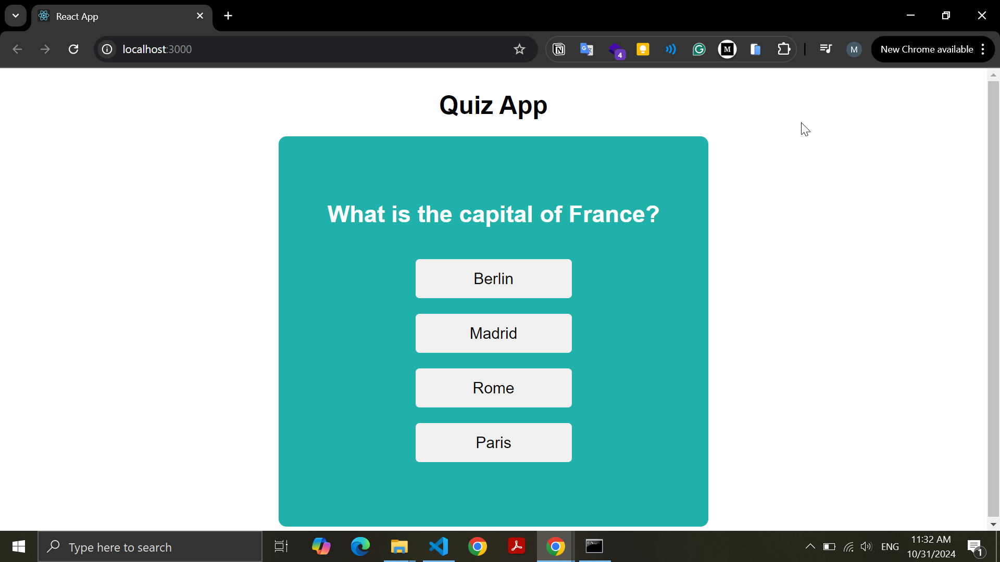

# Quiz App

A simple quiz application built with React to test users' knowledge on various topics through multiple-choice questions.

## Screenshots



## Installation

1. **Clone the repository:**

   ```bash
   git clone https://github.com/mohamednaeemm/quiz-app.git
   ```

2. **Navigate to the project directory:**

   ```bash
   cd quiz-app
   ```

3. **Install dependencies:**

   ```bash
   npm install
   ```

4. **Start the development server:**

   ```bash
   npm start
   ```

   The app will be available at [http://localhost:3000](http://localhost:3000).

## Usage

- Select an answer for each question and navigate through the quiz.
- After completing the quiz, Your Result will appear.

## Technologies Used

- **React**: Frontend framework for building UI components.
- **JavaScript (ES6+)**: Core language for functionality.
- **HTML & CSS**: For structuring and styling the application.